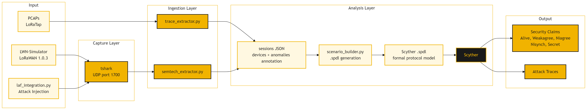

# FAoL: Formal Analysis of Simulated Adversarial LoRaWAN Traffic

**David Trail | Bhaskar Rimal | University of Idaho**

FAoL is an automated pipeline that ingests LoRaWAN traffic captures (real or synthetic), detects structural anomalies corresponding to five known attack classes, generates [Scyther](https://github.com/cascremers/scyther) SPDL formal models, and verifies security properties under the Dolev-Yao adversary model.



---

## Quick Start

**Requirements:** Docker

```bash
git clone --recurse-submodules https://github.com/dtrailnf24/faol.git
cd faol
docker build -t faol .

# Reproduce all 5 synthetic test cases
docker run --rm faol
```

Expected output: `Synthetic validation: ALL PASSED`

---

## Usage

### Analyze a LoRaTap PCAP (over-the-air sniffer format)

```bash
docker run --rm -v /path/to/data:/data --entrypoint bash faol -c "
  python3 trace_extractor.py /data/capture.pcap /data/sessions.json &&
  python3 scenario_builder.py /data/sessions.json /data/scenario.spdl"
```

### Analyze a Semtech UDP/1700 PCAP (gateway format)

```bash
docker run --rm -v /path/to/data:/data --entrypoint bash faol -c "
  python3 semtech_extractor.py /data/capture.pcap /data/sessions.json &&
  python3 scenario_builder.py /data/sessions.json /data/scenario.spdl"
```

### Attack injection with LWN-Simulator

```bash
# List available attack types
docker run --rm --entrypoint python3 faol laf_integration.py --list-attacks

# Inject attacks into synthetic background traffic
docker run --rm --network host --entrypoint python3 faol \
  laf_integration.py \
    --attacks devnonce_replay,fcnt_replay,rogue_ns \
    --with-simulator --sim-devices abp \
    --duration 20 --output /tmp/faol_out
```

---

## Detected Anomaly Classes

| Anomaly | Attack | Scyther Protocol |
|---------|--------|-----------------|
| DevNonce reused across JoinReqs | Replay attack | `Replay` |
| FCnt counter repeated or rolled back | Frame replay | `DataReplay` |
| JoinAccept with no matching JoinReq | Rogue network server | `RogueNS` |
| JoinReq MIC verifies with a public default AppKey | Passive key compromise | `DefaultKey` |
| No anomalies | Baseline | `Baseline` |

---

## Repository Structure

```
pcap_analysis/
├── trace_extractor.py      # Ingestion: LoRaTap PCAP → sessions JSON
├── semtech_extractor.py    # Ingestion: Semtech UDP/1700 PCAP → sessions JSON
├── scenario_builder.py     # SPDL generation: sessions JSON → Scyther model
├── lwn_validator.py        # End-to-end synthetic validation harness
├── laf_integration.py      # Attack injection via LWN-Simulator + LAF
├── laf_attacks/            # LAF packet payload definitions
└── attacks/
    ├── templates/          # SPDL protocol templates (one per attack class)
    └── *.json              # Attack scenario configurations
models/scyther/
├── lorawan_1.0.spdl        # Eldefrawy et al. LoRaWAN 1.0 reference model
├── lorawan_1.1.spdl        # Eldefrawy et al. LoRaWAN 1.1 reference model
└── *.txt                   # Protocol spec appendix text
LWN-Simulator-main/         # LoRaWAN network simulator (git submodule)
Dockerfile                  # Reproducible build (verified)
docker-compose.yml          # Optional: mount local PCAPs via ./data
```


## Dependencies

| Tool | Purpose | How obtained |
|------|---------|-------------|
| [Scyther v1.3.0](https://github.com/cascremers/scyther) | Formal protocol verification | Pre-built Linux binary pulled in Dockerfile |
| [LWN-Simulator](https://github.com/arslab/lwnsimulator) | LoRaWAN network simulation | Built from source in Dockerfile (Stage 1) |
| Python `cryptography` | Default-key MIC verification | Installed via pip in Dockerfile |
| tshark | PCAP parsing for LoRaTap format | Installed via apt in Dockerfile |

---

## Reference Models

`models/scyther/lorawan_1.0.spdl` and `lorawan_1.1.spdl` are adapted from:

> Eldefrawy et al., "Formal security analysis of LoRaWAN," *Computer Networks*, vol. 148, pp. 328–339, 2019. [doi:10.1016/j.comnet.2018.11.017](https://doi.org/10.1016/j.comnet.2018.11.017)

These are documentation only, the FAoL pipeline uses the templates in `pcap_analysis/attacks/templates/`.

---
